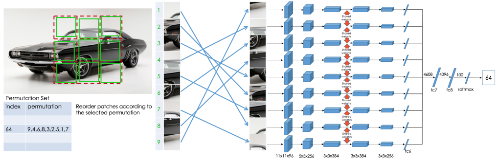

# Unsupervised Learning of Visual Representations by Solving Jigsaw Puzzles
Pytorch implementation of the paper ["Unsupervised Learning of Visual Representations by Solving Jigsaw Puzzles"](https://arxiv.org/abs/1603.09246) by Mehdi Noroozi et al.





## Requirements
- [numpy](http://www.numpy.org/)
- [torch](https://pytorch.org/)
- [torchvision](https://pypi.org/project/torchvision/)
- [scipy](https://pypi.org/project/scipy/)
- [pillow](https://pypi.org/project/Pillow/)
- [tqdm](https://pypi.org/project/tqdm/)

## Project Structure

```
.
├─ modules/
│  ├─ Layers.py                <- LRN layer class
│  └─ network.py               <- Jigsaw Puzzle network
│
├─ dataset.py                  <- Load and prepare tiny-ImageNet dataset 
├─ utils.py                    <- Utility functions
├─ train.py                    <- Train the model
├─ eval.py                     <- Evaluate the model
├─ permutations.py             <- Create a permutation.npy file
├─ main.py                     <- Main function to train and evaluate the network
├─ CFN.png          
└─ README.md
```


## Usage
To begin with, run the `permutations.py` file to create the permutation file needed to prepare the dataset. Then, you need to download the ImageNet dataset. You can simply run the script `tinyimagenet.sh`.

To train and evaluate the main model (Context Free Network) on Tiny-ImageNet dataset, set up your configuration (parameters) and run the script as follows:

```
python3 main.py
```

## Acknowledgment
This repo relies mainly on this implemented published [here](https://github.com/bbrattoli/JigsawPuzzlePytorch).
