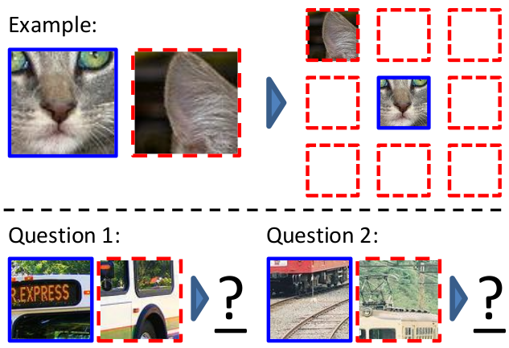
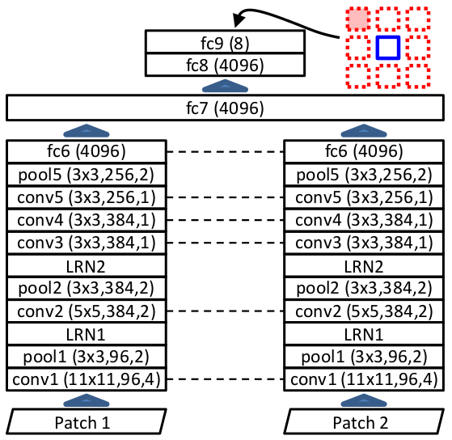

# Unsupervised Visual Representation Learning by Context Prediction
Pytorch implementation of Context-Prediction (CP) representation learning proposed by [Doersch et al.](https://arxiv.org/abs/1505.05192).



## Introduction
Given only a large unlabeled dataset, they extract random pairs of patches from each image and train a convolutional neural net to predict the position of the second patch relative to the first. The main architecture contains a pair of AlexNet-style Networks that process each patch separately, until a specific depth after which point the representations are fused (see architecture below).


## Requirements
- [numpy](http://www.numpy.org/)
- [torch](https://pytorch.org/)
- [torchvision](https://pypi.org/project/torchvision/)
- [scipy](https://pypi.org/project/scipy/)
- [pillow](https://pypi.org/project/Pillow/)
- [matplotlib](https://pypi.org/project/matplotlib/)


## Project Structure

```
.
├─ Chromatic_aberration/
│  ├─ dataset.py                   <- Chromatic Aberration dataset class
│  └─ model.py                     <- Chromatic Aberration Network
│
├─ dataset.py                      <- Clustering functions 
├─ utils.py                        <- Utility functions and classes
├─ model.py                        <- AlexNet architecture
├─ main.py                         <- main file to train AlexNet on CP
├─ main_nearest_neighbors.py       <- Evaluation on Nearest neighors
├─ main_chromatic_aberration.py    <- Experiment on Chromatic Aberration
├─ architecture.png          
├─ example.png          
└─ README.md
```



## Usage
First, you need to download the ImageNet dataset. You can simply run the script `tinyimagenet.sh`.

To train the main model (AlexNet archietcture) on Tiny-ImageNet dataset, set up your configuration (parameters) and run the script as follows:

```
python3 main.py
```


## Evaluation
Here, as the authors mentioned, we provide two evaluation protocols:
* Nearest-Neighbors
* Chromatic Aberration

You can use one of them by running either `main_nearest_neighbors.py` or `main_chromatic_aberration` file.

## Acknowledgment
This repo relies mainly on this notebook [here](https://github.com/abhisheksambyal/Self-supervised-learning-by-context-prediction/blob/master/Self_supervised_learning_by_context_prediction.ipynb).
