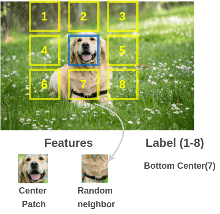

# Self-Supervised-Context-Prediction
Pytorch Implementation of two context prediction methods in self-supervised manner for training and evaluation.



## Introduction
Over the last few years, self-supervision has taken attention and leads to great improvements comparable to full-supervised modesl or even better in some cases which make it as the next stage in deep learning approaches. The problem here is to find a certain source of supervision to apply such a concept. Indeed, context has proven to be a powerful source of automatic supervisory signal for learning representations.

## Project Structure

```
.
├─ CP/                  <- Context Prediction based on a AlexNet architecture
│  └─ ...
│
├─ CFN/                 <- Context-Free Network Algorithm
│  └─ ...
│
├─ tinyimagenet.sh      <- Download and Extract ImageNet-200k dataset
├─ intro.png          
└─ README.md
```


## References
1. [Unsupervised Visual Representation Learning by Context Prediction](https://arxiv.org/abs/1505.05192).
2. ["Unsupervised Learning of Visual Representations by Solving Jigsaw Puzzles"](https://arxiv.org/abs/1603.09246).
